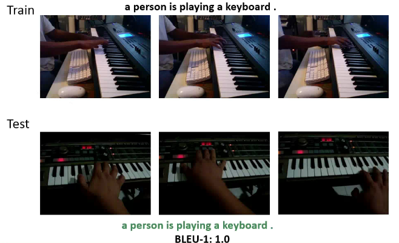

# Video Captioning
Automatically generating description for video content has been an important task in the field of Computer Vision. Since the input is a sequence of video frames, and the caption output is a sequence of words, sequence learning models that are wisely used in machine translation task can also be used for this task. This repo implements a sequence learning model (encoder-decoder) for video captioning using PyTorch framework. The encoder uses [VGG-16](https://arxiv.org/abs/1409.1556) model pretrained on the [ILSVRC-2012-CLS](http://www.image-net.org/challenges/LSVRC/2012/) dataset for extracting visual feature of video frames. Both the encoder and the decoder are Gated Recurrent Unit (GRU) networks.





#### Training time
For the encoder part, the pretrained CNN extracts the feature vector from a given input image. The feature vector is linearly transformed to have the same dimension as the input dimension of the LSTM network. For the decoder part, source and target texts are predefined. For example, if the image description is **"Giraffes standing next to each other"**, the source sequence is a list containing **['\<start\>', 'Giraffes', 'standing', 'next', 'to', 'each', 'other']** and the target sequence is a list containing **['Giraffes', 'standing', 'next', 'to', 'each', 'other', '\<end\>']**. Using these source and target sequences and the feature vector, the LSTM decoder is trained as a language model conditioned on the feature vector.

#### Test time
In the test phase, the encoder part is almost same as the training phase. The only difference is that batchnorm layer uses moving average and variance instead of mini-batch statistics. This can be easily implemented using [encoder.eval()](https://github.com/yunjey/pytorch-tutorial/blob/master/tutorials/03-advanced/image_captioning/sample.py#L41). For the decoder part, there is a significant difference between the training phase and the test phase. In the test phase, the LSTM decoder can't see the image description. To deal with this problem, the LSTM decoder feeds back the previosly generated word to the next input. This can be implemented using a [for-loop](https://github.com/yunjey/pytorch-tutorial/blob/master/tutorials/03-advanced/image_captioning/model.py#L57-L68).


## Usage


#### 1. Download the dataset

```bash
$ pip install -r requirements.txt
$
$
```

#### 2. Preprocessing

```bash
$ python
$ python
```

#### 3. Train the model

```bash
$ python train.py
```

#### 4. Test the model

```bash
$ python sample.py --image='png/example.png'
```

<br>

## Pretrained model
If you do not want to train the model from scratch, you can use a pretrained model.
